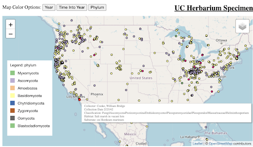
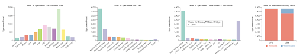

# UC Herbarium Visualization Documentation
## Introduction/Motivation
Our application displays information about the UC Herbarium’s specimen collection. It includes a variety of data about each specimen, including that specimen’s scientific name, the date and location where the specimen was found, and the name of the individual who found the specimen. Additionally, the application’s interactive graphs can be used to filter using filter fields such as collected month, contributors, scientific class, and more.

## Data
This data comes from the UC Herbarium and is a database of seed specimens collected over the last 200 years. We preprocessed the data to only include the information we need for the application to minimize unnecessary information handling. The complete data set can be found using the link: https://www.mycoportal.org/portal/collections/individual/index.php?occid=4788561. 

## Visualization Components

### Map
The map is a leaflet map with dragging ability to change the tiles that are visible. It can also be zoomed in to see with greater detail. There are multiple different maps that can be switched using a dropdown menu in the top right of the map, these include a topographical map, a street view, and two others. The specimens collected are represented by dots on the map which, when moused over, show a tooltip with information on the specimen collected. When clicked on, these dots open a new browser tab to the collection online. There are three different fills for the dots which can be changed by the buttons above the map. There are linear scales for the year the specimen was collected and the days into the year it was collected and there is an ordinal scale which represents the phylum of the specimen. The legend is dynamically updated and is found in the bottom left of the map. The data can be filtered on the map either by selections made on other charts, such as specific years on the timeline, or a brush can be used on the map using CTRL + left click drag. Any filters of the data done can be reset with the reset button in the top right of the page.

### Treemap
The treemap shows the distribution of the samples at each taxonomic rank. When the application is first loaded, the reset button is clicked, or filters are placed on the data in another chart, it will default to displaying the distribution of samples across the kingdoms. If the rectangle for a classification is large enough for a label, the name of the classification and the number of samples that fall under that classification will be displayed. The classification name and number of samples can also be seen for any of the rectangles by hovering over them. When a rectangle is clicked, the treemap will be updated to show the distribution of those samples at the next highest taxonomic rank. For example, when the Fungi kingdom rectangle is clicked, the distribution of all Fungi samples across the phylums will be shown. This can be repeated until the distribution of species along a hierarchical path is shown in the treemap. When a rectangle is clicked, the selection made will be displayed in text immediately above the treemap. Each successive selection is added to represent a path through the hierarchy to what is currently shown in the treemap. This text can be clicked to reset the treemap back to the original distribution of samples across the kingdoms. As mentioned before, it will update to display the distribution of samples across kingdoms when the data is filtered in another component of the application. 

### Timeline
The application displays the distribution of when the samples were collected as a bar chart. Every year is shown as a bar, with the height corresponding to the number of samples in the dataset that were collected within that year. When hovering over a bar, a tooltip displays the year and number of samples collected. The timeline can be brushed with a left click drag to select a time period. Immediately after releasing, the data will be filtered to only show the samples collected within that time frame, and all the visualizations will update. When filters are placed on the data in other visualizations, the timeline axes will update to show all years from 1859 to 2017, but previous brushing done on the timeline will still apply. The timeline can be brushed to show shorter time spans and eventually only show one year; however, the reset button must be used to return to a larger timespan.

### Bar Charts
Our application includes three bar charts and one stacked bar chart, which show several distributions of our data. The bar charts include  “Num. of Specimens Per Month of Year,” “Num. of Specimens Per Class,” and “Num. of Specimens Collected Per Contributor,” each of which display the data as described by their title. The stacked bar chart, titled “Num. of Specimens Missing Data,” visualizes how much of the dataset is missing information from the GPS or Date columns. For all of the bar charts, selecting a bar filters all charts in the application according to the selection, showing only data represented by that bar. Additionally, the bar charts will filter alongside the other visualizations when brushing is applied to either the map or the timeline, and will reset to their default state when the “Reset” button is clicked.

## Design
This time, include a section with your design sketches and design justifications.

### Application Layout:
We placed the map and tree map at the top of the application because we felt that they were the most visually and interactively engaging and would draw the users attention the most so placing it at the top immediately draws the users attention to what will be interacted with the most.
The timeline was placed under these two because, besides the map, we felt users would interact most with the timeline to filter the data. We used a bar graph for it because we felt that since some years had many specimens collected while others had few or none collected, a line graph would be difficult to follow and a bar chart makes the numbers more clear to observe.
Finally the bar charts and stacked bar charts were placed at the bottom since they show more detailed data that the user may not be interested in, at least initially, so it was placed at the bottom to not be a distraction.

### Map:
For the coloring for the two linear scales the specific hues do not mean anything in particular but we chose two different colors for it so that when switching between color scales the differences would be very pronounced. For the ordinal color scale we chose pastel colors because it was easy to see on the map itself and darker colors were not.
The legend was placed on the map itself to save space as well as leave no confusion for what the legend was for.

### Treemap:
The large amount of data meant a tree would be very large and hard to read or needed to be collapsible. A treemap would be readable while taking up a fixed amount of space.
Iterating through the taxonomic ranks kept the number of rectangles shown to a reasonable number and allowed the user to explore the distribution all the way down to species. Showing all the data at once would have required displaying thousands of rectangles or only showing the distribution through a higher rank, such as order.

### Timeline:
A bar chart was selected because the data for each year is independent - it does not depend on previous years. The number of samples collected also jumps from year to year, so one year could have over a thousand samples, while the next may have less than one hundred, and a line graph would have had many spikes. Because some years had over a thousand samples, representing each sample individually with a circle would have made the visualization very cluttered.
A horizontal rotation that spanned the entire width of the application was selected for the final application. The horizontal rotation allowed more pixels for the width of each bar to be big enough to read. We debated making the width of the chart smaller, fixing the width of each bar, and letting the user pan through the timeline, but that would have made it more difficult to see the pattern in sample collection over the entire 200 year time span.
A neutral, desaturated blue that was used in the other bar charts was chosen for the timeline because the height and area of the bars indicated the number of samples collected. Adding a color scale to indicate the difference would have been redundant and would detract from the use of color in other parts of the application.

### Bar Chart:
The bar charts are placed at the bottom of the application because it offers the most specific information that is not easily visible simply by looking at the map or timeline, but the user, if interested, can click on a bar and observe the impact on the rest of the application
 

### Stacked Bar Chart:
To represent counts of the samples shown that had and did not have data for the GPS coordinates and date collected, three types of plots were considered. The first was a pair of pie charts, the second was a stacked bar chart, and the third was a grouped bar chart. Since the plot would be placed in a row with other bar charts, a type of bar chart was selected to fit in with the other charts. A stacked bar chart was selected since there was often a big difference between the number of samples with data and without, resulting in a huge difference in the heights of the grouped bars. 

## Findings
1 section on what your application enables you to discover: Present some findings you arrive at with your application. 
This application allows users to make discoveries of geographically where specimens were collected as well as chronologically when specimens were collected. They are able to discover things geographically with the map and chronologically with the timeline. An interesting chronological discovery is that the majority of the specimens were collected between 1930 and 1940, which was during the Great Depression, this makes me curious as to why this is happening. The image below shows the samples collected during that time period.

I can also see that the vast majority of samples collected during this time were done by a single person. I can also see that the majority of the specimens were collected in Ohio, California, and Washington as well as what their scientific hierarchy is. Shown below is the application filtered for the collector who was very active.

Lastly, by brushing on the map, I was able to see that the majority of the samples from Europe were collected in the late 1800s, as shown in the screenshot below.

## Process
1 section on your process- what libraries did you use?  How did you structure your code?  How can you access it and run it?  Link to your code (and the live application, if it is deployed online). 
For this project we used four different libraries. First we used the general d3 library which took care of all of our charts, not including the map. For the leaflet map we used three different libraries, the basic leaflet map library which allowed us to build it, the map select area library which allowed us to add a simple brush to the map itself with minimal additional work done, and the d3-legend library which allowed for simple automated legends to be built which saved us some time and effort when creating the legends for the leaflet map.

The way that the code is structured is that all of the interactions between the charts, as well as their initialization, are taken care of within the main. It is also where the legends are created for the map. All of the charts themselves are taken care of within their own classes where, even when showing different data, each chart type has a shared class. So, all of the bar charts are created using the same class and the stacked bar charts are created using the same class.

There are two ways to run the code. First, you can download the code and launch a python http server locally and then run the code on the server. The code can be found at: https://github.com/swiimii/vis_project2. The second option is that the application is deployed online and can be found at: https://www.sam-scherer.com/vis_project2/. 

## Demo
https://www.youtube.com/watch?v=jPEKUJ4xKfc

## Division of Work
This time, document who on your team did which component of the project.  Ex.  If someone worked on the data, and on bar charts, list their effort on these components. 
Our project included three contributors: Jennifer, Joe, and Sam. Jennifer created the Timeline Visualization, Treemap, and Stacked Bar Chart visualizations. Joe created the leaflet map visualization. Sam created the non-stacked Bar Charts and ensured all visualizations interacted with each other correctly. All team members put a lot of effort into the project, and contributed towards documentation.

